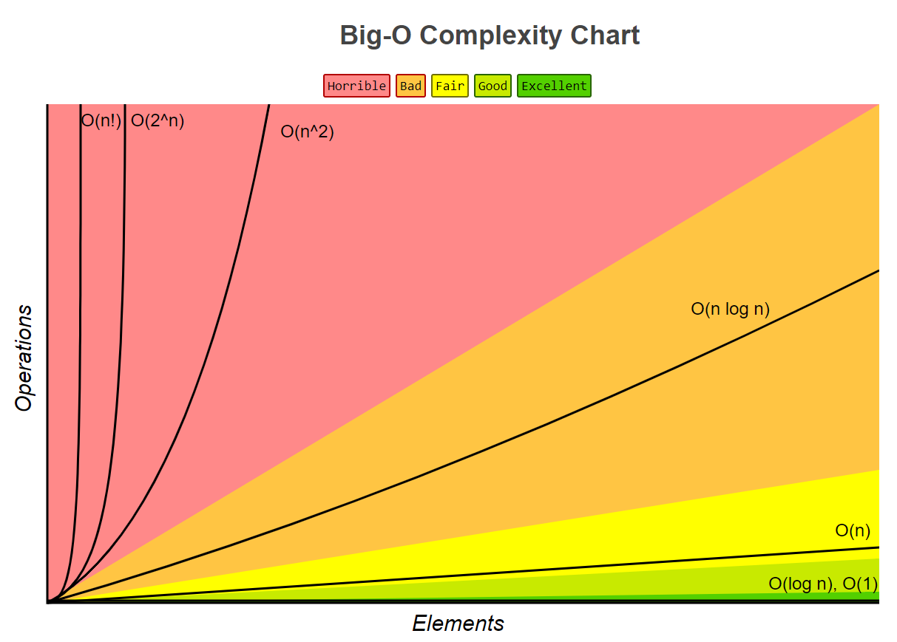
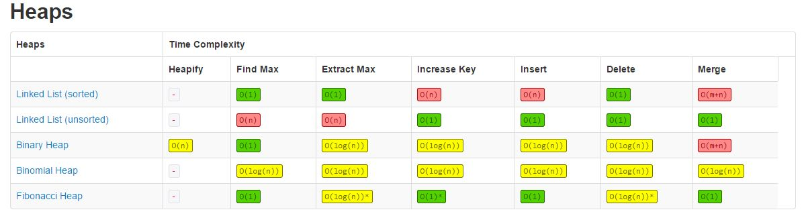
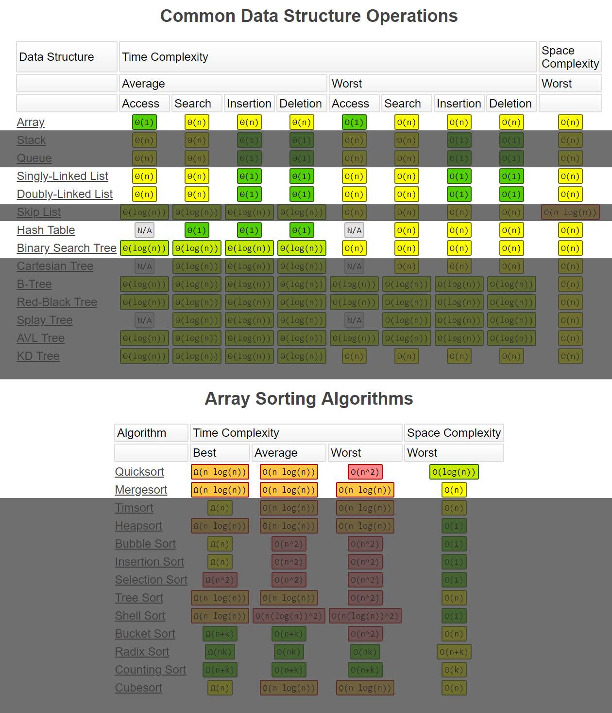

# Big O notation 

## Time complexities

### O(1)

Constant time. Never changes in respect to # of inputs.

### O(log n)

Logarithmic time. Highly efficient, as the ratio of the number of operations to the size of the input decreases and tends to zero when _n_ increases.

### O(n)

Linear time. Scales linearly with # of inputs.

### O(n²)

Quadratic time. Highly inefficient as _n_ grows.

### O(2ⁿ)

Exponential time. Crazy inefficient as _n_ scales up.

### O(n!)

Factorial time. Hilariously inefficient.

## Space complexities

Space complexity is the amount of memory used by the algorithm (including the input values to the algorithm) to execute and produce the result.

OR

Space complexity is a measure of the amount of working storage an algorithm needs. That means how much memory, in the worst case, is needed at any point in the algorithm. As with time complexity, we're mostly concerned with how the space needs grow, in big-Oh terms, as the size N of the input problem grows.

## Tables

## Resources

- [Wikipedia - Computational complexity](https://en.wikipedia.org/wiki/Computational_complexity)
- [Wikipedia - Time complexity](https://en.wikipedia.org/wiki/Time_complexity)
- [Big-O Cheat Sheet](http://bigocheatsheet.com/)
- [Getting Sorted & Big O Notation - Computerphile](https://youtu.be/kgBjXUE_Nwc?t=452)
- [Big O Notation - Gayle Laakmann McDowell](https://www.youtube.com/watch?v=v4cd1O4zkGw)
- [Big O Notations - Derek Banas](https://www.youtube.com/watch?v=V6mKVRU1evU)
- [Northwestern University - Space Complexity EECS 311](https://www.cs.northwestern.edu/academics/courses/311/html/space-complexity.html)
